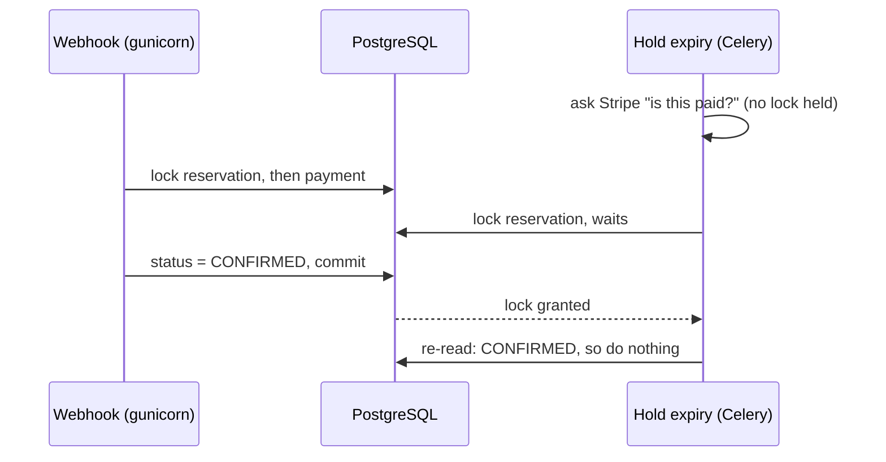

# CineVault: design notes

These notes cover the decisions in CineVault that aren't obvious from reading the code:
how double booking is prevented, how the seat hold and the Stripe webhook avoid stepping
on each other, and what I'd change if the site got a lot busier. The README covers
features and setup. This file covers why things work the way they do.

## The booking lifecycle

A booking moves through three states:

```
            reserve seats               webhook: payment_intent.succeeded
  (none) ─────────────────► PENDING ──────────────────────────────────► CONFIRMED ─► ticket email
                               │
                               │ hold expires unpaid, or payment fails
                               ▼
                           CANCELLED  (seat rows deleted, seats back on sale)
```

Reserving creates the reservation as `PENDING` and holds the seats for 10 minutes. The
customer pays through a Stripe PaymentIntent, but the browser never confirms the booking
itself. Only Stripe's webhook does that, because the browser can be closed, lose its
connection, or be lying. If nobody pays within 10 minutes, a Celery task cancels the
reservation and gives the seats back.

## Preventing double booking

The guarantee comes from one line in `reservations/models.py`:

```python
class Meta:
    unique_together = ('seat', 'showtime')   # on ReservationSeat
```

The database won't store two rows for the same seat at the same showtime, whatever the
application does. Everything else in the booking path exists to give the customer a nicer
error before they hit that constraint.

There are three layers, in the order a request meets them:

1. **A check in `validate()`.** It looks for existing seat rows on pending or confirmed
   reservations. It catches the common case, a seat someone booked a minute ago, with a
   clear message. It can't be the real protection, because it's check-then-insert: two
   requests can both pass the check before either one inserts.
2. **A short Redis lock per seat** (`cache.add`, which only succeeds if the key doesn't
   exist yet). If two people click the same seat at the same moment, the second one gets
   "currently being reserved by another user" straight away, without a database round trip.
3. **The unique constraint.** If both requests still get through, the insert of the
   second one fails with `IntegrityError` inside its transaction. I turn that into a
   validation error, so the customer sees "just booked by someone else" instead of a 500.

So Redis is there for speed and a friendlier message, not for correctness. If a lock
expired early or got lost, the worst case is that the second customer sees the
`IntegrityError` message instead of the Redis one. Nobody gets the same seat twice.
(If Redis is down entirely, `cache.add` raises and booking returns an error. That's an
availability problem, not a correctness one.)

One detail matters for this to keep working: cancelling a reservation **deletes** its
seat rows (`Reservation.cancel()`), rather than just flipping the status. If the rows
stayed, the unique constraint would keep a cancelled seat unbookable forever.

## The webhook vs. the hold expiry

This is the trickiest part of the system. Two separate processes can make a decision
about the same reservation at the same moment:

- a **gunicorn worker** handling Stripe's `payment_intent.succeeded` webhook, which wants
  to confirm the booking;
- a **Celery worker** running `cancel_reservation_if_unpaid` at the 10-minute mark, which
  wants to cancel it.

Without coordination, each reads the reservation as `PENDING`, makes its decision, and
the last write wins. That gives you either a paid booking that got cancelled, or a
"confirmed" booking whose seats were already released and resold.

Both sides take a row lock with `select_for_update()` and re-check the status *after*
getting it:



Three choices here:

- **Same lock order on both sides: reservation first, then payment.** If one side locked
  payment first and the other reservation first, each could end up holding the lock the
  other needs: a deadlock. With the same order, one simply waits for the other.
- **The expiry task asks Stripe outside the lock.** A Stripe API call can take a second
  or more. Holding a row lock that long would make the webhook wait on it. So the task
  asks first, then locks and re-reads the status, because the webhook may have landed
  during that Stripe call.
- **A payment that arrives after the seats were released isn't forced through.** The
  reservation stays cancelled and the payment is marked `refunding`; a Celery task
  refunds it through Stripe. Confirming it would give the customer a ticket for seats
  that may already belong to someone else.

The two tests in `payments/test_concurrency.py` exercise this for real. One transaction
holds the lock, the other side runs in a thread, and the test waits until Postgres
reports that thread as blocked on the lock. SQLite ignores `SELECT ... FOR UPDATE`, so
these tests only run in the PostgreSQL CI job.

## Payments: duplicates and ordering

Stripe delivers webhook events *at least once* and doesn't promise their order, so the
handler has to be safe to run twice and in any order:

- **Signature first.** `stripe.Webhook.construct_event` checks the event really came
  from Stripe. Anything else gets a 400.
- **Duplicates.** If the payment row is already `succeeded`, the handler doesn't send a
  second ticket. Confirming an already-confirmed reservation is harmless; a second email
  isn't.
- **Out of order.** A declined first card can be reported *after* a second card on the
  same intent succeeded. If the payment is already `succeeded`, a late
  `payment_intent.payment_failed` is ignored rather than cancelling a paid booking.
- **The email waits for the commit.** The ticket task is queued with
  `transaction.on_commit`, so a Celery worker can never pick up a reservation this
  transaction hasn't finished writing. If the transaction rolls back, no email goes out.

On the other side, `create-intent` reuses the reservation's existing PaymentIntent as
long as the customer can still pay it. Before that fix, reopening checkout created a
new intent and forgot the old one. A customer who paid in an older tab was charged, but
the webhook couldn't match the payment, and the booking expired. Now:

- an unpaid intent is returned again, so every tab pays the same intent;
- a paid or processing intent gets a 409, so a second tab can't start a second charge;
- a cancelled intent is replaced.

New intents use an idempotency key built from what they replace:
`cinevault-reservation-<id>-replacing-<old intent id or "none">`. If two requests race
to create the same intent (a double click), they send the same key and Stripe returns
one intent. I didn't use a counter, because two racing requests would both read the
same count and then disagree about the next number. Stripe errors return a 502 with a
"try again" message instead of a 500.

## Background jobs

Three things run in Celery: verification and password-reset emails, ticket emails, and
the hold expiry. Email goes through Celery because SMTP is slow and sometimes fails, and
neither should block or break a web request. Stripe in particular expects a webhook
answer within seconds.

- Email tasks retry with exponential backoff and jitter. A refused SMTP connection is
  usually temporary.
- `CELERY_TASK_ACKS_LATE = True` means a task is only acknowledged after it finishes.
  If a worker dies halfway through, the task runs again rather than being lost. That's
  only safe because the tasks are written to be repeatable: the expiry task re-checks
  the status, and the ticket task refuses anything that isn't confirmed.
- The Redis broker's `visibility_timeout` is 900 seconds, longer than the 600-second
  delay on the hold-expiry task. With Redis as the broker, a task scheduled further
  ahead than the visibility timeout gets delivered twice.

If the worker is down, bookings still work, but emails arrive late and unpaid holds
aren't released until it comes back.

## Query performance

Every list endpoint is paginated (20 per page, up to 100 with `?page_size=`) with an
explicit `order_by` ending in `id`. Without a stable order, rows can repeat or go
missing between pages.

The movie list used to run one extra query per movie for its genres; it's now
`prefetch_related('genres')`. The tests pin the movie list to exactly three queries
(count, page, genres) and check that the showtime, seat map and reservation lists use
the same number of queries for one row as for many. That way an N+1 can't come back
without a test failing.

The frontend builds the catalogue in the browser from all movies and all showtimes, so
`api.js` follows `next` until the last page rather than reading only the first.

## Deployment

```
internet ─► Caddy (TLS) ─► nginx (static files, /media, proxy) ─► gunicorn (Django)
                                                                   ├─► PostgreSQL
                                                                   └─► Redis ◄── Celery worker
```

- Only Caddy publishes ports. PostgreSQL, Redis and gunicorn are reachable only inside
  the Docker network.
- The entrypoint waits for Postgres to accept connections, then runs migrations, in the
  `web` container only. Two containers running `migrate` at once can apply operations
  out of order.
- `exec "$@"` makes gunicorn PID 1, so it receives Docker's SIGTERM and shuts down
  cleanly instead of being killed mid-request.
- `/api/health/` deliberately doesn't touch the database or Redis. It answers "is
  gunicorn serving requests". A health check that fails on one slow query would get a
  healthy container restarted.

## Known limitations, and what I'd change if it got busy

What's missing today:

- **Prices are whole numbers** (no cents) (#6), and there's no error monitoring yet (#9).

If traffic grew by 10×, my first changes would be:

1. **Store webhook events and process them in Celery.** The handler already copes with
   duplicates and any order, so the endpoint can just verify the signature, save the
   event and answer 200 straight away. A slow database then can't make Stripe time out
   and retry.
2. **Cache the catalogue.** Movies and showtimes change rarely and are read on every
   visit. Caching those responses for a minute, and clearing the cache when an admin
   edits them, would take most of the read load off Postgres.
3. **Add monitoring before adding servers.** Error tracking, plus a metric for "payments
   whose refund failed", would show what actually breaks under load before I start
   guessing.
