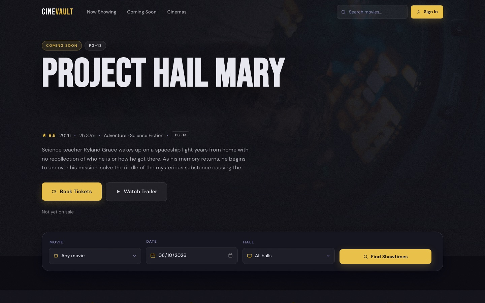
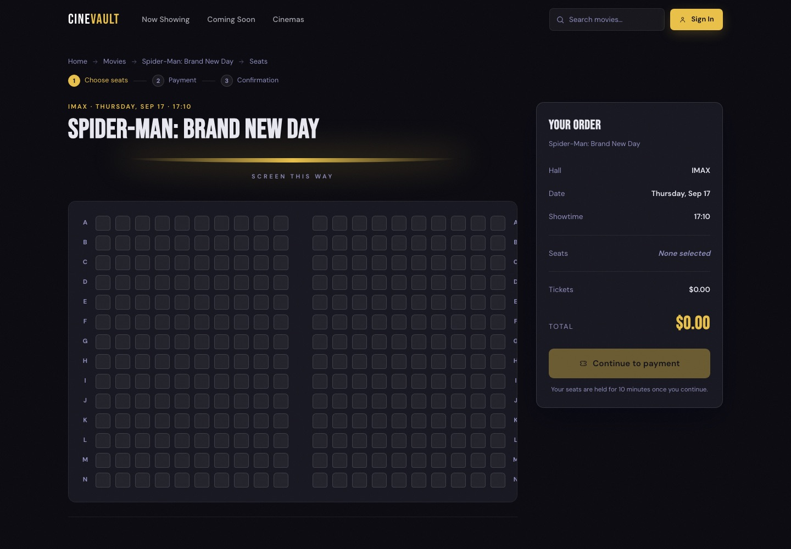
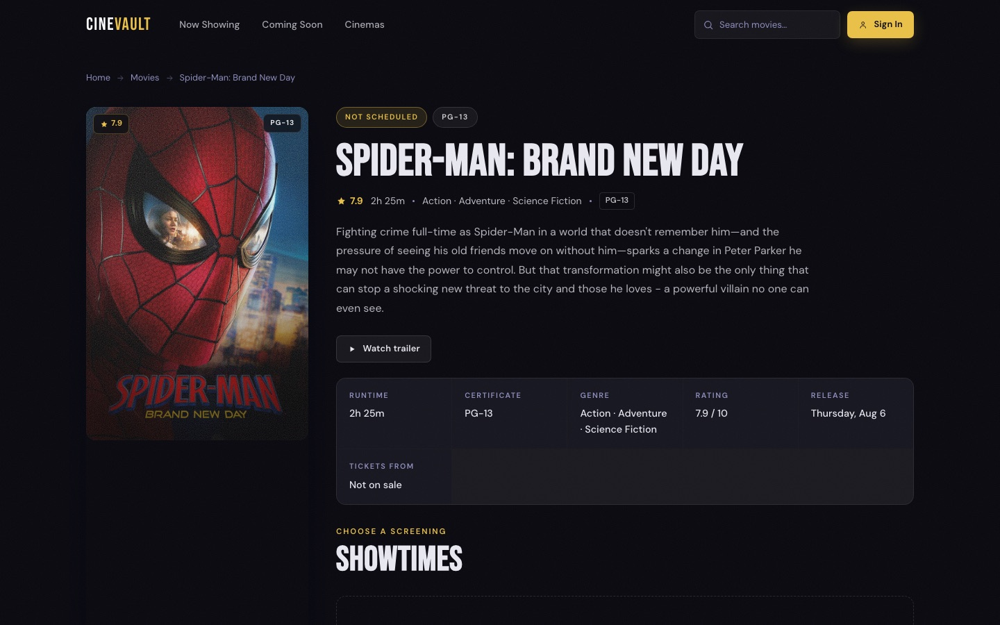

# CineVault

A movie reservation service: browse films and showtimes, pick seats on a live seat map,
pay with Stripe and get the ticket by email. The backend is a Django REST Framework API.
Payments, seat holds and emails all run through Celery and Redis.

**Live:** [cinevault.uz](https://cinevault.uz/)



| Seat selection | Movie page |
|---|---|
|  |  |

---

## Features

- **Accounts.** Registration with JWT auth, email verification by a 6-digit code stored in
  Redis, password reset, and role-based permissions (customer, staff, superuser).
- **Catalogue.** Movies, genres, halls and showtimes. Search movies by title and genre;
  filter showtimes by movie, hall and date.
- **Seat reservation without double-booking.** Seats are reserved inside a database
  transaction, protected by a unique `(seat, showtime)` constraint, so two people can
  never buy the same seat.
- **10-minute seat hold.** A Celery task releases the seats if the reservation is still
  unpaid after 10 minutes.
- **Stripe payments.** PaymentIntents plus a signature-verified webhook. The webhook is
  idempotent: Stripe can deliver the same event twice, and the customer still gets only
  one ticket. A payment that arrives after its hold has expired is logged for a refund
  instead of confirming a booking that has no seats.
- **Async email.** Verification codes, password resets and tickets are sent by Celery
  workers, with automatic retries and backoff.
- **API docs.** OpenAPI schema and Swagger UI generated by drf-spectacular.

## Tech stack

| Layer | Tools |
|---|---|
| API | Python, Django, Django REST Framework, SimpleJWT, django-filter, drf-spectacular |
| Data | PostgreSQL (SQLite for local runs), Redis |
| Background jobs | Celery |
| Payments | Stripe |
| Frontend | Plain HTML, CSS and JavaScript, served from the same origin as the API |
| Deployment | Docker Compose, Gunicorn, nginx, Caddy (automatic HTTPS) |

## Architecture

```
                      :80 :443
                          │
                       ┌──▼────┐
                       │ caddy │   TLS certificates
                       └──┬────┘
                       ┌──▼────┐   /              → frontend (static files)
                       │ nginx │   /static/ /media/
                       └──┬────┘   /api/ /admin/  → proxied to gunicorn
                     ┌────▼────┐
                     │   web   │  Django + gunicorn
                     └──┬───┬──┘
              ┌─────────┘   └────────┐
         ┌────▼───┐              ┌───▼───┐
         │   db   │              │ redis │◄──── worker (Celery)
         │postgres│              │       │
         └────────┘              └───────┘
```

Only Caddy is exposed to the internet. PostgreSQL, Redis and Gunicorn are reachable only
inside the Docker network.

## API overview

All endpoints live under `/api/v1/`. Full docs are at `/swagger/` when running locally.

| Area | Endpoints |
|---|---|
| Auth | `auth/register` · `auth/verify-email` · `auth/login/` · `auth/token/refresh/` · `auth/me` · `auth/password-reset/` |
| Movies | `movies/` · `movies/<id>` · `genres/` |
| Halls | `halls/` · `halls/<id>/seats` |
| Showtimes | `showtimes/` · `showtimes/<id>` · `showtimes/<id>/seats/` |
| Reservations | `reservations/` · `reservations/<id>/` |
| Payments | `payments/create-intent/<reservation_id>/` · `payments/webhook/` |

## Running locally

Requirements: Python 3.13+, a running Redis, and optionally the
[Stripe CLI](https://docs.stripe.com/stripe-cli) for testing payments.

```bash
git clone https://github.com/sanjarbek-ashurboyev/Cinevault.git
cd Cinevault
python3 -m venv .venv
.venv/bin/pip install -r requirements.txt
cp .env.example .env          # fill in your own values
make migrate
make seed                     # real films, halls and a 10-day schedule
make superuser
make dev                      # API :8000 + Celery + frontend :5500 + Stripe listener
```

Run `make` with no arguments to see every available command.

## Deployment

The production setup runs six containers with Docker Compose. The step-by-step guide,
including HTTPS, backups and updates, is in [DEPLOY.md](DEPLOY.md).

## License

[MIT](LICENSE)
